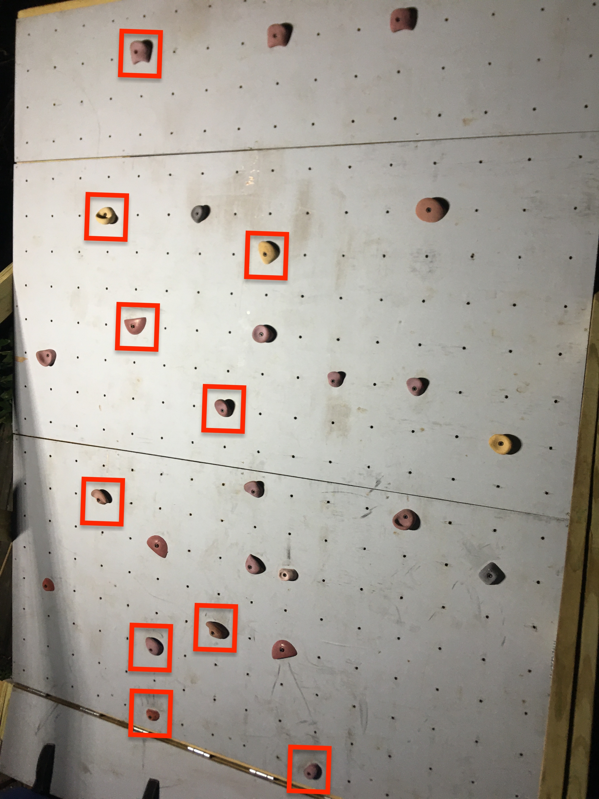

# Climbr

A "staging" version of the app is available at https://climbr-stage.herokuapp.com and a "production" version is available at https://climbr-pro.herokuapp.com

This project is based off of the [palletsprojects Flask tutorial](https://flask.palletsprojects.com/en/1.1.x/tutorial/). The code was updated to use a Postgres database following this [real python tutorial](https://realpython.com/flask-by-example-part-2-postgres-sqlalchemy-and-alembic/)

---
## TODO
- show preview of route when hovering over link to details page: https://stackoverflow.com/questions/10769016/display-image-on-text-link-hover-css-only
- overlay route onto image of wall with routes; draw bounding boxes around the holds that are part of specified route
    - 
- add profile view that shows all routes posted by user
- make labels for checkboxes visible by pressing button
- show editable grid of holds on the update page
- show only holds that are on current configuration of the wall
- implement filtering by route difficulty
- add route difficulty to schema
- implement uploading image: https://flask.palletsprojects.com/en/1.1.x/patterns/fileuploads/
- implement email verification: https://realpython.com/handling-email-confirmation-in-flask/
- get opencv working on heroku (https://stackoverflow.com/questions/49469764/how-to-use-opencv-with-heroku)
- figure out how to fix climbr-pro so that app can be deployed there
- fix climbr so that edit doesn't show if the user didn't post that posting
- add feature to upload/download route data

- add color coding for start

## DO THIS TODAY
- include new javascript code (drawboxes and stringify) on create and view pages
	- https://stackoverflow.com/questions/4855430/how-can-i-send-a-variable-to-a-form-using-this-javascript-function
	- https://stackoverflow.com/questions/11178426/how-can-i-pass-data-from-flask-to-javascript-in-a-template
    - https://stackoverflow.com/questions/33355159/how-can-i-dynamically-render-images-from-my-images-folder-using-jinja-and-flask